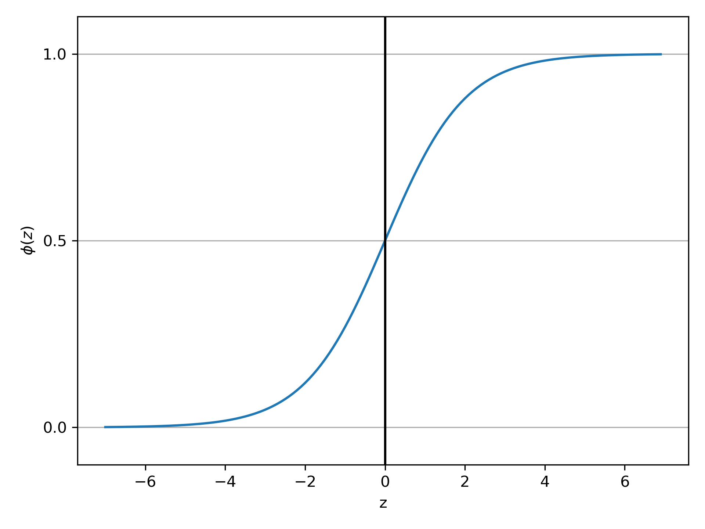

# ロジスティック回帰

ロジスティック回帰は回帰モデルではなく分類に用いられるモデル。

**オッズ比(odds ratio)**
は事象の起こりやすさを示す。

$$(オッズ比)\coloneqq\dfrac{p}{1-p}$$

ここで、予測したい事象を示す正事象(positive event)のクラスラベルを $y=1$ として考え、
オッズ比の対数を取ったものをロジット(logit)関数と呼ぶ。

$$logit(p)=\log\dfrac{p}{1-p}$$

このロジット関数は0から1の入力を受け取り、実数全体( $\infin\sim-\infin$ )に変換する。
このロジット関数の出力を重みと特徴量の線形和と仮定して

$$logit(p(y=1|\boldsymbol{x}))=w_0x_0+w_1x_1+\cdots+w_mx_m=\sum_{i=0}^mw_ix_i=\boldsymbol{w}^T\boldsymbol{x}$$

$p(y=1|\boldsymbol{x})$ は特徴量 $x$ が与えられた場合にデータ点がクラス1に属する条件付き確率。

実際に関心があるのはデータ点がクラスに所属している確率なので、ロジット関数の逆数を求める。これは
**ロジスティックシグモイド関数(logistic sigmoid)**
あるいは単に**シグモイド関数**と呼ばれる。

$$
\begin{split}
&z=\boldsymbol{w}^T\boldsymbol{x}=\log\dfrac{p}{1-p}=\log\dfrac{\Phi(z)}{1-\Phi(z)}\\
&e^z=\dfrac{\Phi(z)}{1-\Phi(z)}\\
&\Phi(z)=\dfrac{e^z}{1+e^z}=\dfrac{1}{1+e^{-z}}
\end{split}
$$

このシグモイド関数は入力値を実数値として受け取り、 $\Phi(z)=0.5$ を切片として入力値を0と1に分けることが出来る。

ロジスティック回帰では、ADALINEと比較すると、ADALINEで線形活性化関数を利用していたところでシグモイド関数を利用する。
すなわち活性化関数としてシグモイド関数を利用する。

シグモイド関数と閾値関数の違いは値が連続か不連続か。

特徴量$x$が重み$w$でパラメータ化されるとすれば、シグモイド関数の出力は、データ点がクラス1に所属している
確率$\Phi(z)=P(y=1|\boldsymbol{x};\boldsymbol{w})$と解釈する。

閾値関数を利用して確率を二値の成果指標に変換すると、

$$\hat{y}=\begin{cases}1\qquad\Phi(z)\geq0.5\\0\qquad\Phi(z)\leq0.5\end{cases}$$

これを上で示したシグモイド関数について$z$軸基準で考えると、

$$\hat{y}=\begin{cases}1\qquad z\geq0\\0\qquad z\leq0\end{cases}$$

# ロジスティック関数の重み学習

誤差平方和のコスト関数は以下の通り

$$J(\boldsymbol{w})=\sum_i\dfrac{1}{2}(\Phi(z^{(i)})-y^{(i)})^2$$

ロジスティック回帰におけるコスト関数を導出するために、ロジスティック回帰モデル構築時に最大化したい**尤度**(結果
から見たところの条件の尤もらしさ)を定義する。

$$L(\boldsymbol{w})=P(y=1|\boldsymbol{x};\boldsymbol{w})=\prod_{i=1}^{n}P(y^{(i)}|x^{(i)};\boldsymbol{w})
=\prod_{i=1}^n(\Phi(z^{(i)}))^{y^{(i)}}(1-\Phi(z))^{1-y^{(i)}}

$$

これの対数を取ったものを**対数尤度(log-likelihood)**と呼び以下の通りに示される。

$$l(\boldsymbol{s})=\log L(\boldsymbol{w})=\sum_{i=1}^{n}[y^{(i)}\log(\Phi(z^{(i)}))+(1-y^{(i)})\log(1-\Phi(z^{(i)}))]$$

