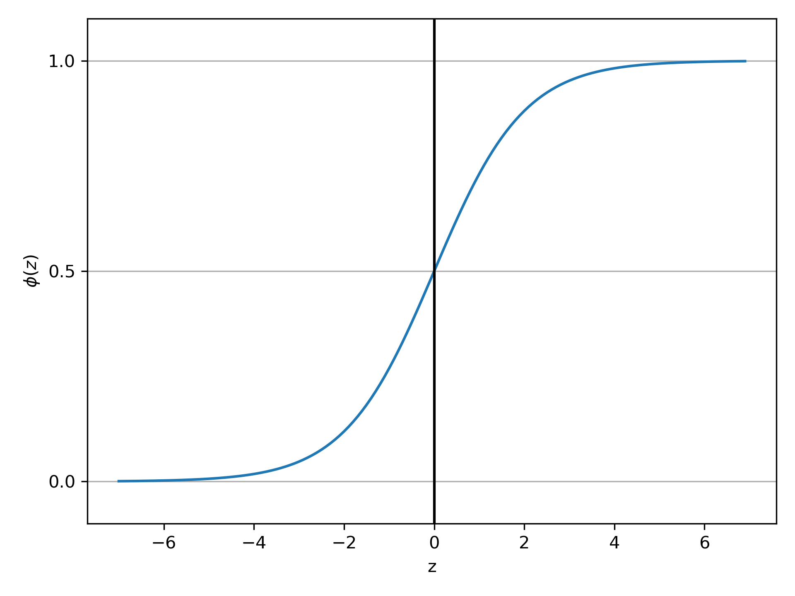
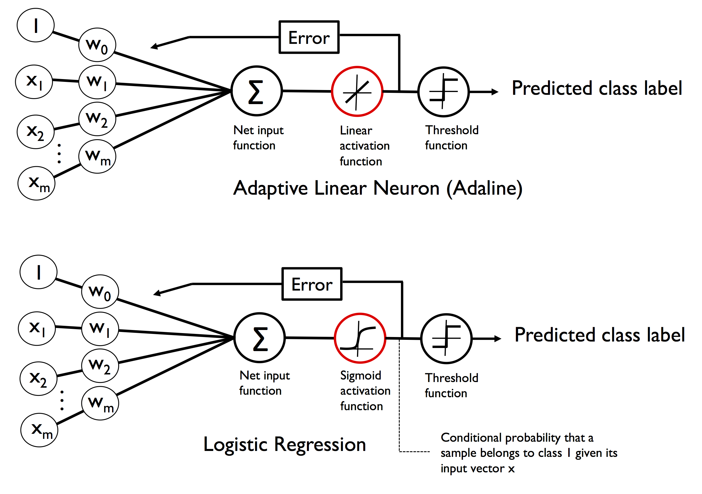

# ロジスティック回帰

ロジスティック回帰は回帰モデルではなく分類に用いられるモデル。

**オッズ比(odds ratio)**
は事象の起こりやすさを示す。

$$(オッズ比)\coloneqq\dfrac{p}{1-p}$$

ここで、予測したい事象を示す正事象(positive event)のクラスラベルを $y=1$ として考え、
オッズ比の対数を取ったものをロジット(logit)関数と呼ぶ。

$$logit(p)=\log\dfrac{p}{1-p}$$

このロジット関数は0から1の入力を受け取り、実数全体( $\infty\sim-\infty$ )に変換する。
このロジット関数の出力を重みと特徴量の線形和と仮定して

$$logit(p(y=1|\boldsymbol{x}))=w_0x_0+w_1x_1+\cdots+w_mx_m=\sum_{i=0}^mw_ix_i=\boldsymbol{w}^T\boldsymbol{x}$$

$p(y=1|\boldsymbol{x})$ は特徴量 $x$ が与えられた場合にデータ点がクラス1に属する条件付き確率。

実際に関心があるのはデータ点がクラスに所属している確率なので、ロジット関数の逆数を求める。これは
**ロジスティックシグモイド関数(logistic sigmoid)**
あるいは単に**シグモイド関数**と呼ばれる。

$$
\begin{split}
&z=\boldsymbol{w}^T\boldsymbol{x}=\log\dfrac{p}{1-p}=\log\dfrac{\Phi(z)}{1-\Phi(z)}\\
&e^z=\dfrac{\Phi(z)}{1-\Phi(z)}\\
&\Phi(z)=\dfrac{e^z}{1+e^z}=\dfrac{1}{1+e^{-z}}
\end{split}
$$

このシグモイド関数は入力値を実数値として受け取り、 $\Phi(z)=0.5$ を切片として入力値を0と1に分けることが出来る。

ロジスティック回帰では、ADALINEと比較すると、ADALINEで線形活性化関数を利用していたところでシグモイド関数を利用する。
すなわち活性化関数としてシグモイド関数を利用する。

シグモイド関数と閾値関数の違いは値が連続か不連続か。

特徴量 $x$ が重み $w$ でパラメータ化されるとすれば、シグモイド関数の出力は、データ点がクラス1に所属している
確率 $\Phi(z)=P(y=1|\boldsymbol{x};\boldsymbol{w})$ と解釈する。つまり、 $P(y=0|\boldsymbol{x};\boldsymbol{w})=1-P(y=1|\boldsymbol{x};\boldsymbol{w})=1-\Phi(z)$

閾値関数を利用して確率を二値の成果指標に変換すると、

$$
\hat{y}=
\begin{cases}
1\qquad\Phi(z)\geq0.5\\
0\qquad\Phi(z)\leq0.5\end{cases}
$$

これを上で示したシグモイド関数について$z$軸基準で考えると、

$$
\hat{y}=
\begin{cases}
1\qquad z\geq0\\
0\qquad z\leq0
\end{cases}
$$

# ロジスティック関数の重み学習

誤差平方和のコスト関数は以下の通り

$$J(\boldsymbol{w})=\sum_i\dfrac{1}{2}(\Phi(z^{(i)})-y^{(i)})^2$$

ロジスティック回帰におけるコスト関数を導出するために、ロジスティック回帰モデル構築時に最大化したい**尤度**(結果
から見たところの条件の尤もらしさ)を定義する。

$$
L(\boldsymbol{w})=P(\boldsymbol{y}|\boldsymbol{x};\boldsymbol{w})=\prod_{i=1}^{n}P(y^{(i)}|x^{(i)};\boldsymbol{w})
=\prod_{i=1}^n(\Phi(z^{(i)}))^{y^{(i)}}(1-\Phi(z))^{1-y^{(i)}}
$$

これの対数を取ったものを
**対数尤度(log-likelihood)**
と呼び以下の通りに示される。

$$l(\boldsymbol{w})=\log L(\boldsymbol{w})=\sum_{i=1}^{n}[y^{(i)}\log(\Phi(z^{(i)}))+(1-y^{(i)})\log(1-\Phi(z^{(i)}))]$$

通常は勾配上昇法などを用いてこの尤度が最大化するように最適化を行う。勾配降下法を用いてコスト関数を最小化するため、
尤度をコスト関数として書き直す。

$$
J(\boldsymbol{w})=\sum_{i=0}^{n}[-y^{(i)}\log(\Phi(z^{(i)}))-(1-y^{(i)})\log(1-\Phi(z^{(i)}))]
$$

単一の訓練データに対して計算されるコストを考えると、

$$
J(\Phi(z),y;\boldsymbol{w})=-y\log(\Phi(z))-(1-y)\log(1-\Phi(z))
$$

この式を見ればわかるように、 $y=0$ の時は一つ目の項が、 $y=1$ の時は二つ目の項が0になる。

$$
J(\Phi(z),y;\boldsymbol{w})=
\begin{cases}
-\log(\Phi(z))\qquad(y=1)\\
-\log(1-\Phi(z))\qquad(y=0)
\end{cases}
$$

ADALINE実装のアルゴリズムをロジスティック回帰アルゴリズムに変更するには、ADALINEのコスト関数を上のコスト関数に変更すればよい。
さらに、線形活性化関数をシグモイド関数活性化関数に置き換え、閾値関数も-1,1ではなく0,1を返す。

ここで、学習アルゴリズムの重み更新規則は、ロジスティック回帰とADALINEとで同等であることを示す。

対数尤度関数を $j$番目の重みに関して偏微分する。

$$
\dfrac{\partial}{\partial w_j}l(\boldsymbol{w})=\left(y\dfrac{1}{\Phi(z)}-(1-y)\dfrac{1}{1-\Phi(z)}\right)\dfrac{\partial}{\partial w_j}\Phi(z)
$$

シグモイド関数の偏微分は

$$
\dfrac{\partial}{\partial z}\Phi(z)=\dfrac{\partial}{\partial z}\dfrac{1}{1+e^{-z}}=\Phi(z)(1-\Phi(z))
$$

式を組み合わせて書き換えると、

$$
\begin{split}
\left(y\dfrac{1}{\Phi(z)}-(1-y)\dfrac{1}{1-\Phi(z)}\right)\dfrac{\partial}{\partial w_j}\Phi(z)
&=\left(y\dfrac{1}{\Phi(z)}-(1-y)\dfrac{1}{1-\Phi(z)}\right)\Phi(z)(1-\Phi(z))\dfrac{\partial}{\partial w_j}z\\
&=(y-\Phi(z))x_j
\end{split}
$$

重みごとに更新を行い、対数尤度を最大化させる重みを見つけ出すことが目的のため、

$$
w_j\coloneqq w_j+\eta\sum_{i=1}^n(y^{(i)}-\Phi(z^{(i)}))x_j^{(i)}
$$

全ての重みを同時に更新するため、

$$
\boldsymbol{w}\coloneqq\boldsymbol{w}+\Delta\boldsymbol{w}
$$

重みの更新量 $\Delta w$は次のように定義する。

$$
\Delta w=\eta\nabla l(\boldsymbol{w})
$$

対数尤度の最大化は上で定義したコスト関数の最小化に等しいため、

$$
\Delta w_j\coloneqq-\eta\dfrac{\partial J}{\partial w_j}=\eta\sum_{i=1}^n(y^{(i)}-\Phi(z^{(i)}))x_j^{(i)}
$$

よって、 $\boldsymbol{w}\coloneqq\boldsymbol{w}+\Delta\boldsymbol{w}$ 、 $\boldsymbol{w}=\eta\nabla J(\boldsymbol{w})$
となりADALINEと等しい。

# 正則化による過学習への対処

**過学習(overfitting)**
は機械学習によく見られる問題であり、訓練データでは上手く機能するが、テストデータでは上手く汎化しないという問題である。
過学習が発生しているモデルは**high variance**と表現される。
原因としてはパラメータの数が多すぎることが挙げられる。

同様に
**学習不足(underfitting)**
に陥る場合もある。これは、訓練データのパターンを上手く捕捉するにはモデルの複雑さが十分ではなく、未知のデータに対する性能が低いことを意味する。このようなモデルは**high bias**と表現される。

baisとvarianceはどちらかを小さくしたらどちらかが大きくなトレードオフの関係にある。
トレードオフを探る方法の1つとして正則化に基づいてモデルの複雑さを調整することが挙げられる。

正則化は
**共線性(collinearity)**
を処理する便利な手法であり、データからノイズを取り除き、過学習を防ぐ。

正則化の背景にある考え方は、極端なパラメータの重みにはペナルティを科すための追加情報(バイアス)を導入するものである。

最も一般的な正則化は
**L2正則化(L2 regularization)**
であり、以下のように記述される

$$
\dfrac{\lambda}{2}||\boldsymbol{w}||^2=\dfrac{\lambda}{2}\sum_{j=1}^mw_j^2
$$

$\lambda$ は
**正則化パラメータ(regularization parameter)**
である。

正則化を適用するにはロジスティック回帰でていぎしたコスト関数に対して、重みを小さくするための正則化項を追加すればよい。

$$
J(\boldsymbol{w})=\sum_{i=0}^{n}[-y^{(i)}\log(\Phi(z^{(i)}))-(1-y^{(i)})\log(1-\Phi(z^{(i)}))]+\dfrac{\lambda}{2}||\boldsymbol{w}||^2
$$

scikit-leaanのLogisticRegression関数のCパラメータは正則化パラメータの逆数である。

