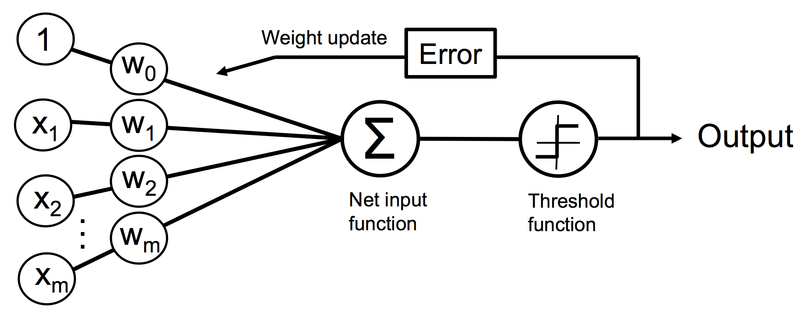
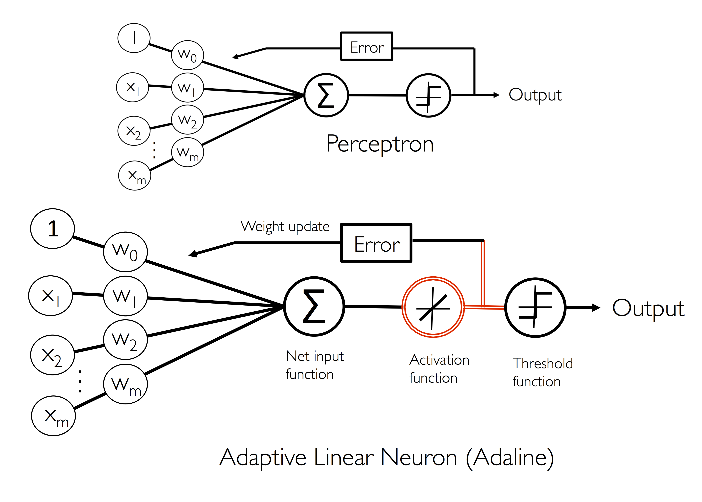
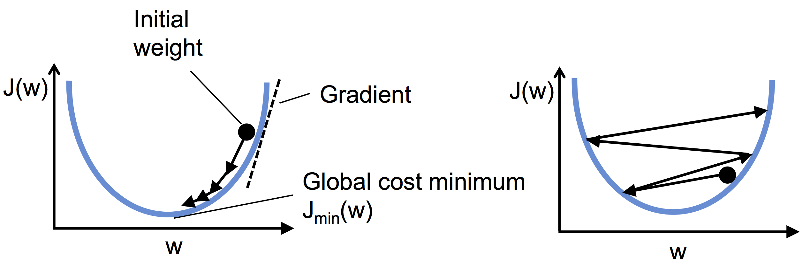

# 人工ニューロン

実際の神経細胞におけるニューロンの発火/未発火を再現したモデル。概念的には二分類タスクとして捉えられる。

入力値 $\boldsymbol{x}$ と重み $\boldsymbol{w}$ から得られる
総入力値$z$に対し、

$$
\Phi(z)=
\begin{cases}
1\qquad(z\geq\theta)\\
-1\qquad(z<\theta)
\end{cases}
$$

の決定関数が定義できる。 $\theta$ は状態が遷移(クラスラベルの決定)するための閾値であり、
一般的にはこれを $w_0$ として**bais**と呼ぶ。
こえを踏まえて上の式を書き直すと、

$$
z=w_0 x_0+w_1 x_1+\cdots+w_m x_m =
\begin{bmatrix}
w_0\\w_1\\\vdots\\ w_m
\end{bmatrix}^T
\begin{bmatrix}
x_0\\x_1\\\vdots\\ x_m
\end{bmatrix}=
\boldsymbol{w}^T\boldsymbol{x}
$$

$$
\Phi(z)=
\begin{cases}
1\;\;(z\geq0)\\
-1\;\;(z<0)
\end{cases}
$$

上のように書き直せる($x_0=1$としている)。これを**McCulloch-Pittsニューロン**と呼ぶ

# Rosenblattの学習規則
MCPニューロンの学習規則は以下の通り

1. 重みを0または乱数で初期化
1. 訓練データ $\boldsymbol{x^{(i)}}$ ごとに処理を実行
    
    1. 出力値 $\hat{y}$ を計算
    1. 重みの更新

出力値 $\hat{y}$ は決定関数によって求められるクラスラベルとなる。

重み $\boldsymbol{w}$ の定義は以下の通り

$$
w_j\coloneqq w_j+\Delta w_j
$$

 $\Delta w_j$ は重みの更新値であり、学習規則における計算は以下の通り

$$
\Delta w_j=\eta(y^{(i)}-\hat{y}^{(i)})x_j
$$

$\eta$ は学習率と呼ばれ通常0から1の値を取る整数となる。$\hat{y}^{(i)}$は予測されるクラスラベルである。

重みベクトルの更新は全て同時に行われる。

$$
\Delta w_0=\eta(y^{(i)}-\hat{y}^{(i)})
$$

$$
\Delta w_1=\eta(y^{(i)}-\hat{y}^{(i)})x_1
$$

$$
\Delta w_2=\eta(y^{(i)}-\hat{y}^{(i)})x_2
$$

この学習規則の概念図は次の通り

# ADALINE
Roseblattアルゴリズムと異なるアルゴリズムとしてADALINE(ADAptive LInear NEutron)が挙げられる。

ADALINEでは重みの学習に利用する決定関数 $\Phi(z)$ は単にステップ関数ではなく線形活性化関数となる。
ADALINEの学習規則は**Windrow-Hoff則**と呼ばれる。線形活性化関数は総入力の恒等関数となる。

$$
\Phi(\boldsymbol{w}^T \boldsymbol{x})=\boldsymbol{w}^T \boldsymbol{x}
$$

最終的なクラスラベルの決定にはステップ関数を用いる。

# 勾配降下法のによるコスト関数の最小化

ADALINEの場合、学習家庭で最適化される目的関数(Objective Function)としてコスト関数(cost function)を定義する。

ADALINEにおけるコスト関数$J$は誤差平方和(Sum of Squared Error)を用いて次のように示される。

$$
J(\boldsymbol{w})=\dfrac{1}{2}\sum_i(y^{(i)}-\Phi(z^{(i)}))^2
$$

このコスト関数はステップ関数とは異なり**微分可能**であり、下向きの凸関数であるため、
**勾配降下法(gradient descent)**
を用いてコスト(すなわち誤差)が最小となる重み $\boldsymbol{w}$ を求めることが出来る。

勾配降下法では局所最小値に至るまで坂を下るイメージで、1ステップの勾配移動距離は学習率と勾配の傾きで決まる。

勾配の更新は以下のように示される。

$$
\boldsymbol{w}\coloneqq\boldsymbol{w}+\Delta\boldsymbol{w}
$$

また $\Delta\boldsymbol{w}$ は次のように定義される。負の係数は勾配に対して下る方向に向かうためにつけているイメージ。

$$
\Delta\boldsymbol{w}=-\eta\nabla J(\boldsymbol{w})
$$

コスト関数の勾配の計算は各重み $w_j$ で偏微分計算を行う。

$$
\dfrac{\partial J}{\partial w_j}=-\sum_i(y^{(i)}-\Phi(z^{(i)}))x_j^{(i)}
$$

これを用いて重みの更新を記述すると次のようになる。

$$
\Delta w_j=-\eta\dfrac{\partial J}{\partial w_j}=\eta\sum_i(y^{(i)}-\Phi(z^{(i)}))x_j^{(i)}
$$

重みの更新は同時に行う。

$$
\boldsymbol{w}\coloneqq\boldsymbol{w}+\Delta\boldsymbol{w}
$$

学習率が大きすぎる場合は1ステップの移動距離が大きくなり、局所解にたどり着かない場合がある。

