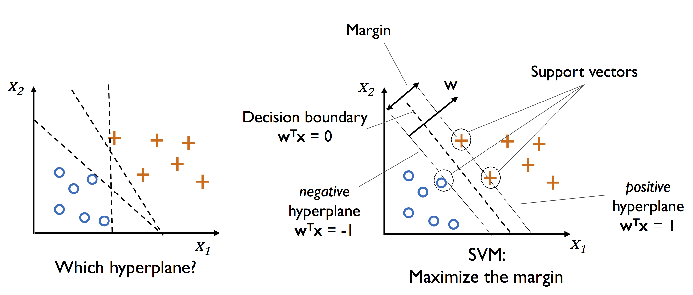

# サポートベクターマシン

**サポートベクターマシン(Support Vector Machine)**
は協力な学習アルゴリズムの一つであり、パーセプトロンの拡張とみなせる。

パーセプトロンアルゴリズムでは誤分類率を最小化するが、SVMの最適化の目的は
**マージン**
の最大化である。マージンは超平面(決定境界)と、超平面に最も近い訓練データの距離として定義される。
超平面に最も近い訓練データは
**サポートベクトル(Support Vector)**
と呼ばれる。

決定境界のマージンを大きくする論理的根拠は汎化誤差が小さくなることである。サポートベクターが決定境界から離れれば
その分精度が上がることは図を見れば明らかである。さらに、理想的な決定境界では
境界上下のマージンの値は一致する。

決定境界とは $\boldsymbol{w}^T\boldsymbol{x}+w_0=0$ の境界であり、
この境界でデータを完全に二分できる状態を線形分離可能と呼ぶ。
この時、 全てのデータ点に関して次の関係が成り立つ。

$$y^{(i)}(\boldsymbol{w}^T\boldsymbol{x}+w_0)>0$$

ここで、正のサポートベクター( $y^{(i)}=1$ 側のサポートベクター)と負のサポートベクター( $y^{(i)}=-1$ 側のサポートベクター)
をそれぞれ $\boldsymbol{x_{pos}}$ 、 $\boldsymbol{x_{neg}}$ とする。また、ある訓練データ $\boldsymbol{x}^{(i)}$ と
決定境界との距離を求めると以下のようになる。

$$
d=\dfrac{|w_1x_1+w_2x_2+\cdots w_mx_m|}{\sqrt{w_1^2+w_2^3+\cdots w_m^2}}
=\dfrac{|\boldsymbol{w}^T\boldsymbol{x}+w_0|}{||\boldsymbol{w}||}
$$

よってマージン $M$ の大きさを求めると以下のようになる。

$$
M=\dfrac{|\boldsymbol{w}^T\boldsymbol{x_{pos}}+w_0|}{||\boldsymbol{w}||}=\dfrac{|\boldsymbol{w}^T\boldsymbol{x_{neg}}+w_0|}{||\boldsymbol{w}||}
$$

$$
\Rightarrow M=\dfrac{\boldsymbol{w}^T\boldsymbol{x_{pos}}+w_0}{||\boldsymbol{w}||}=\dfrac{-(\boldsymbol{w}^T\boldsymbol{x_{neg}}+w_0)}{||\boldsymbol{w}||}
$$

よって、マージンの最大化では

$$
\max_{\boldsymbol{w},w_0}M
$$

となり、さらに全ての訓練データと決定境界との距離がマージン以上となる条件

$$
\dfrac{y^{(i)}(\boldsymbol{w}^T\boldsymbol{x^{(i)}}+w_0)}{||\boldsymbol{w}||}\geq M
$$

$$\left(\Rightarrow\dfrac{1}{M}\dfrac{y^{(i)}(\boldsymbol{w}^T\boldsymbol{x^{(i)}}+w_0)}{||\boldsymbol{w}||}\geq 1\right)$$

を満たす $\boldsymbol{w}$ と $w_0$ を見つけることになる。特にサポートベクターでは等号が成立するため、
$\boldsymbol{w}/{M||\boldsymbol{w}||\rightarrow \boldsymbol{w}}$ 、 $w_0/{M||\boldsymbol{w}||\rightarrow w_0}$として書き直すと以下の通りになる。

$$y^{(i)}(\boldsymbol{w}^T\boldsymbol{x^{(i)}}+w_0)=1$$

よってマージンの最大化の条件は次のようになる。

$$
\max_{\boldsymbol{w},w_0}M=\dfrac{y^{(i)}(\boldsymbol{w}^T\boldsymbol{x^{(i)}}+w_0)}{||\boldsymbol{w}||}=\dfrac{1}{||\boldsymbol{w}||}
$$

逆数をとって最小化の条件式に書き直すと、

$$
\min_{\boldsymbol{w},w_0}M=\dfrac{1}{2}||\boldsymbol{w}||^2
$$

ここで、 $1/2$の項やノルムの2乗は計算を簡単にするために付している。サポートベクターマシンでは
この式を満たす $\boldsymbol{w}$ を求める。

# ソフトマージン分類

上で説明したような線形分離可能なデータに対する分類はハードマージン分類(hard-margin classification)
と呼ぶのに対し、線形分離不可能なデータに対する分類はソフトマージン分類
(soft-margin classification)と呼ぶ。

ソフトマージン分類ではスラック変数 $\xi$ を導入することで、
適切なコストペナルティを科した上で、誤分類が存在する状態のまま最適化問題を収束することが可能になる。

スラック変数を追加した制約式は以下のとおりである。

$$y^{(i)}(\boldsymbol{w}^T\boldsymbol{x^{(i)}}+w_0)\geq(1-\xi^{(i)})\qquad\xi^{(i)}\geq0$$

$y^{(i)}=1$ の場合を考えると、 左辺が1を下回った時そのデータは誤分類されていることになる。
制約式における $\xi$ はこのような誤分類を許容するパラメータを意味し、
$\xi^{(i)}>0$ の時そのデータは誤分類されていることを示す。
$\xi^{(i)}=0$ の時は線形分離可能な状態を示し、データは正しく分類されいていることを示す。

よって誤分類を最小化するにはスラック変数の総和を最小化すればよいので、
最小化の目的関数は次のようになる。

$$
\dfrac{1}{2}+C\left(\sum_i\xi^{(i)}\right)
$$